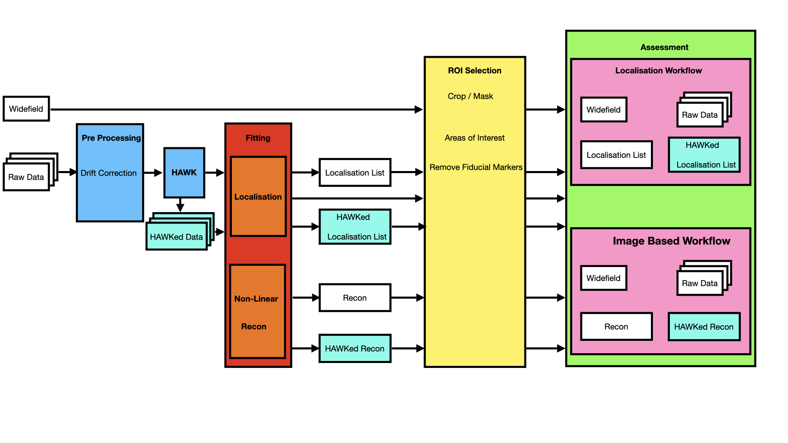
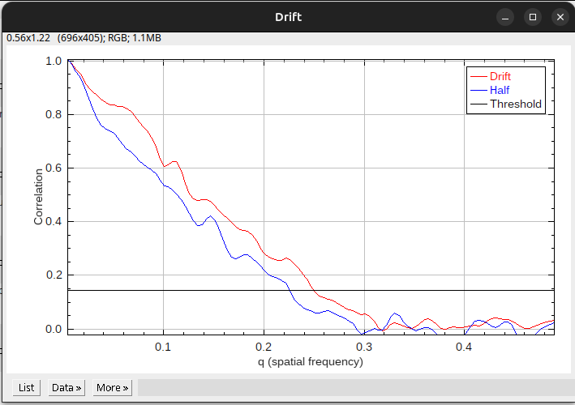
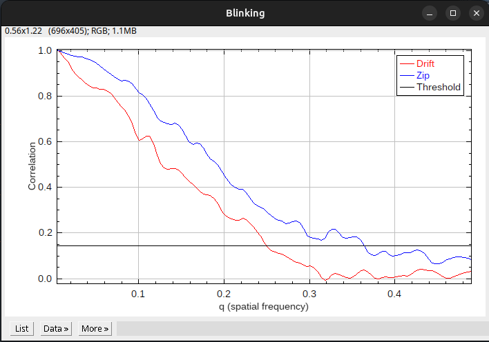
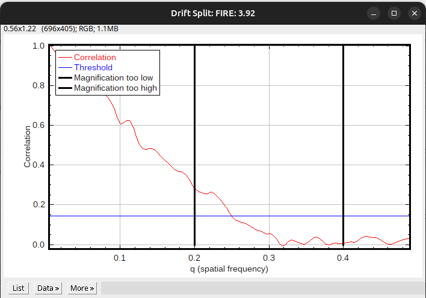
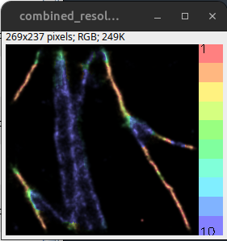
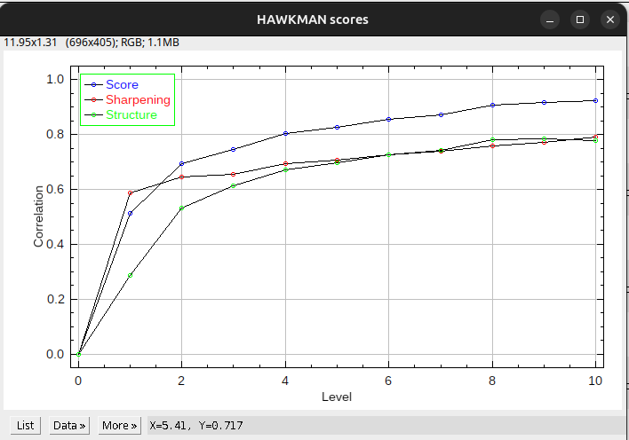
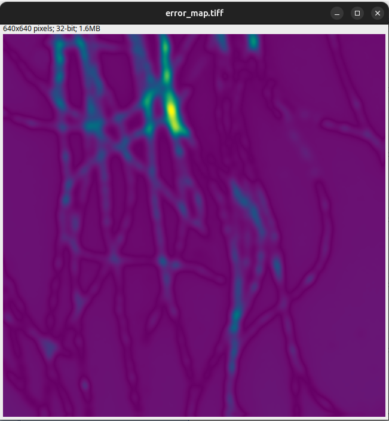

# TERRAPINS - TEsting Resolution, Reliability And Performance IN SMLM 

This tool is for assessing 2D SMLM data quality and reliability. Many issues can affect the quality of this data, this tool aims to give a you both a measure of quality but, also how to tune your experimental setup and highlight the limiting factors of its performance.

# Processing Flow chart

What do I need to do/steps

## Main types of error tested for
 - [Drift](#drift)
 - [Sampling](#sampling)
 - [Blinking](#blinking)
 - [Magnification](#magnification)
 - [Bias](#bias)
 - [Linearity](#linearity)
 - [Limiting Precision](#limiting-precision)

# I want to?

 - [Assess my images to help inform my experimental setup](#assess-my-images-to-help-inform-my-experimental-setup)
 - [Assess my images for a limiting precision score](#assess-my-images-for-a-limiting-precision-score)

## Assess my images to help inform my experimental setup
 - [I am using localisation data](#assess-my-images-to-help-inform-my-experimental-setup-using-localisation-data)
 - [I am using images](#assess-my-images-to-help-inform-my-experimental-setup-using-image-data)

## Assess my images for a limiting precision score
 - [I am using localisation data](#assess-my-images-for-a-limiting-precision-score-using-localisation-data)
 - [I am using images](#assess-my-images-for-a-limiting-precision-score-using-image-data)

## Assess my images to help inform my experimental setup using localisation data
## Assess my images to help inform my experimental setup using image data

## Assess my images for a limiting precision score using localisation data
## Assess my images for a limiting precision score using image data

# The Results Viewer

## Reports
These reports are formed from the truth table logic in????????????

### Drift
This report compares two different FRC curves generated by different ways to split localisation lists to assess if the sample is drifting. The main result can be accessed by clicking the "Show Results" checkbox and looks like this:

This plot shows the two FRC curves. The further apart the two curves are the more drift is present. The different splits of the data are half (by number of frames) vs section splitting (drift split). The score is generated by comparing their resolution (each of which is given in the text output).

### Blinking
The blinking report again compares two different FRC curves techniques generated by different splitting techniques, section (aka drift) vs interleaved (aka zip), and compares their ratio.

The main result can be accessed by clicking the "Show Results" checkbox and looks like this:

The plot shows both curves and we measure the ratio between them in resolution at the 0.5 correlation mark.

### Sampling

This report attempts to assess how well sampled your data is. It is analysing the slope of the FRC curve by comparing the resolution at 2 points. Almost all data is technically undersmapled so the plot shows your data against simulated calibration curves to indicate how you stand up against different sampling regimes.

### Magnification

The magnification report attempts to establish if you have oversampled (mag too high) or undersampled (mag too low) your rendering. If the magnification is too high you may be intoducing sparcity into your images that could affect downstream processing. However if the magnification is too low you could be losing information with analytical relevance. 

The plot, accessed by the "Show Results" checkbox, shows the FRC curve plotted with where we suggest these tolerances lie.

### Localisation
This gives you the mean precision of the localisations if provided you provided a localisation table.

### FRC Resolution

The value is taken from the section split method of splitting the data. The colour however, will reflect if other tests suggest caution in interpreting this result.

### Bias / HAWKMAN

The bias report attempt to establish where and by how much the fitter has introduced bias. The main results from this analysis, accessed by the "Show Results" checkbox, are the combined resolution image and the score plot.

The image colour codes structures by the level of blur at which bias is detected. 

The score plot shows the level of sharpening and structure between the images. The sharpening score compares how much the binarised images agree whilst the structure score compares how well the skeletonised images agree. The global score combines these two metrics into one value and when this score approaches 1 there is no bias left and the level that this it at determines the resolution (level * super resolution pixel size).

### Linearity / SQUIRREL

This report attempts to find where error in the reconstruction is not linear compared to the widefield. It does this by finding optimal parameters for blurring the reconstruction to match the widefield then measurring the difference. 

The main result from this analysis, accessed by the "Show Results" checkbox, is the error map. 

This is the map of differences. Care must be taken intepretting this and close attention paid the scale of the differences and not just the colour of map. It is up to the user what tolerances are significant.

To determine the source of the differences you can compare this map with the bias report map. Shared areas mean the errors in SQUIRREL are probably due to bias, with the remaining due to non-linearities. 

Intepration is also affected by whether you used a true widefield or provide an image stack. The image-stack based approach will capture non-linearities alone whereas with the true widefield we can capture all other sources of error as well. Using both allows for disambiguation of error sources.

### Limiting Precision

Limiting precision attempts to estimate the percentage of maximum possible resolution achieved (calculated from the localisation table - if provided).

## Results
All the reports come from the output of core tools, the details of which can be used to probe your data further.

### Recon Results
These results show the image generated, the output from the rendering process and the localisation table used to generate it. Viewing this image can be a useful sanity check.

### FRC Results
FRC results will always have two images associated with them from the different splits of the data. It can be again be useful to view these images especially for splits like the first half vs second half split; this can show if there was a temporal compoponent to the parts of the image localised, which could effect your results.

### HAWKMAN Results
HAWKAN generates a lot of output. This control lets you view the individual maps generated from the process.

### SQUIRREL Results
SQUIRREL performs a couple of transformations to the data, registration and scaling, both of which can cause issues if errors occur. It can be useful to see what inputs exactly were used to generate the map particulary if you feel the error map is not representative.

# How to get the plugin
Latest ImageJ plugin can be found [here](https://github.com/Assessing-Quality-SMLM/terrapins/releases/latest)

<!-- # What's the point / Scope? 
A number of techniqeus exist for assessing the quality of data produced in a super resolution experiment however, they all measure something slightly different. Alongside this in order to fully intepret their results sometimes information from other tools are required. This means they should be used together to provide a fuller picture of any issues that may be present in your data. 

Whilst several of these tools exist in isolation, this project aims to provide all the tools in one place, accessible across operating systems and analysis platforms to be integrated into users workflows as they see fit. To this end these tools are accessible as ImageJ plugins, Napari plugins and command line tools as well as being open source for anyone to compile as they see fit (we can also create some C API shared objects / dlls / dylibs for integration into other tools if required). 

# Who's it for?
Anyone doing super-res! However, we are focussing providing easy to use tools for people new to the technique.  -->

# FAQ

## My HAWKMAN is being rejected but it looks fine to me /SRRF didn’t throw an error. Is it actually okay?
HAWKMAN failure modes, what to do, but it’s probably just bad

## Fixed pattern noise is being picked up as structure (esp SRRF). Is this really a problem? What do I do?
Most common when SRRF is being used in low density situations. Perhaps try a single or multi emitter fitter.

## My images look fine. Why is the bias report flagging an issue?
The bias report uses the HAWKMAN assessment. This technique can sometimes go awry, particualry on very sparse data during the skeletonisation step. You can manually inspect what the tool has done by heading to the results tab and opening the skeletonisation images and the scores. 

The bias score is determined from global score which weights contributions from each of the maps. It should be increasing linearly as the levels increase if the scores do not do this something has gone wrong. 

If, when you look at the skeletonised images, they are not representative then you can discount this score. 

## My FRC scores are not what I expect?
FRC is based on a Fourier transform; consequently there are 2 main sources of errors, missalignment when cropping a ROI or if your data is highly structured, particularly over long ranges, e.g. a structural motif is repeated across the image. 

In the case of cropping an image take your time and be accurate, FRC can produce unexpected results with single pixel missalignments. Also be sure to crop all the data you are using; widefields, image stacks, recons and recon localisation lists etc.

In the case of highly structured data artefacts can be introduced into the spectrum which can be hard accomodate. If you are only interested in a particular part of the image try cropping it out and running the assessment on that.

Also make sure you have [handled your fiducial markers appropriately](#have-i-excluded-fiducial-markers)

## Is My Data Suitable for Assessment?
This can depend on the exact research question below are some general steps you can take before interpretting the assessment output.

### Is there any data?
Open your images up and look at the histogram. Is what you expect?

### Has my pre-processing been applied correctly?

#### Have I drift corrected effectively?
The drift report can help with this. Some datasets respond better than others to different drift correction techniques as well as their settings. If one technique / settings are not improving the drift report try something else. 

#### Did my fitter do something sensible?
What does the localisation table look like? Localisations should be realistic; psf sigmas should be neither too high nor too low, likewise uncertainty - internally we filter these properties which can remove lots of data if it was not great to begin with. N.B processing can effect these properties as well, for example HAWK processing whilst helping to remove bias will decrese precision.

#### Do I need to merge localisations?
If your reconstructed image shows lots of clustering it may be that localisations need to be merged, or merged more aggressively.

#### Have I excluded fiducial markers?
Fiducial markers can introduce several issues when retained in the assessment images. For example, in FRC based measures they will be in both sets of images regardless of splitting technique masquerading as structure. Equally in the bias test they will distort the adaptive threshold that gets applied to the images. 

We would advise you keep them in for performing drift correction and they can be left in for localising / fitting. However, you will need to either crop out a part of the image without these or mask them out before the assessment. We would reccomend croping them out if possible as masking can introduce other sources of artefact.

<!-- SQUIRREL widefield needs them to be blocked out - common mask. with common mask in widefield will introduce a sharp edge which wont be in super-res with effects of background dominating in this region -->

<!-- # Usage

## ImageJ

### I have Localisation Data

### I have Image Data

## I want to use an Individual Tool

## Napari
Watch this space

## CLI

# It doesn't work / I Have a Problem 
This is actively support so please raise an issue. 

# I Want to Build My Own Binaries
 -->