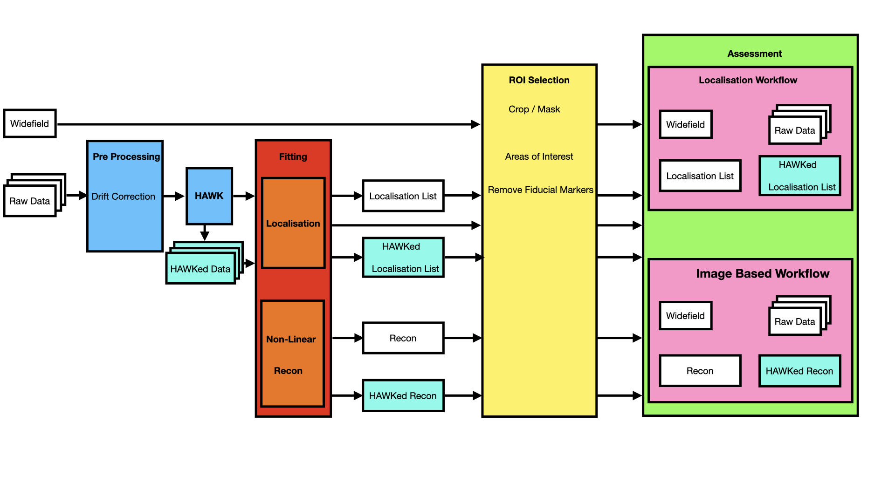
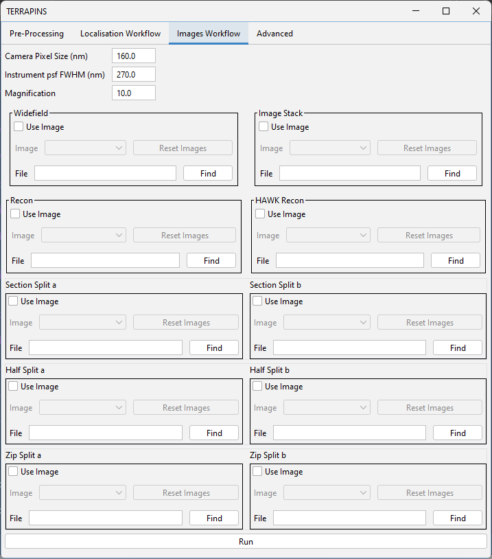
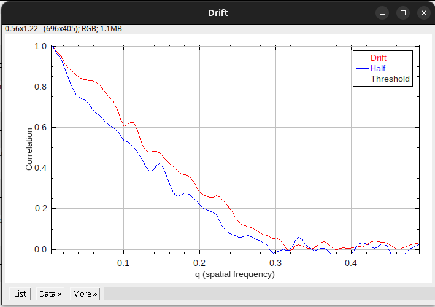
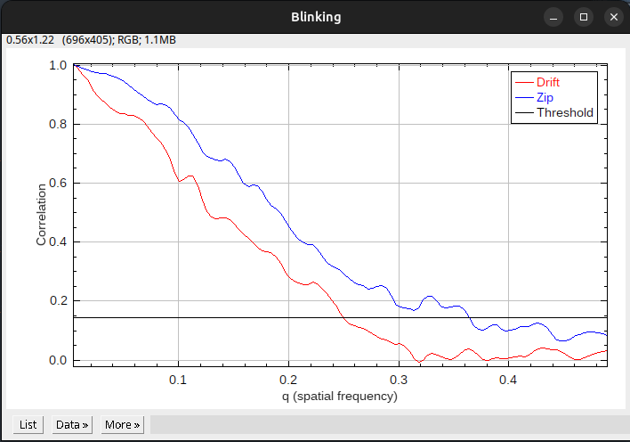
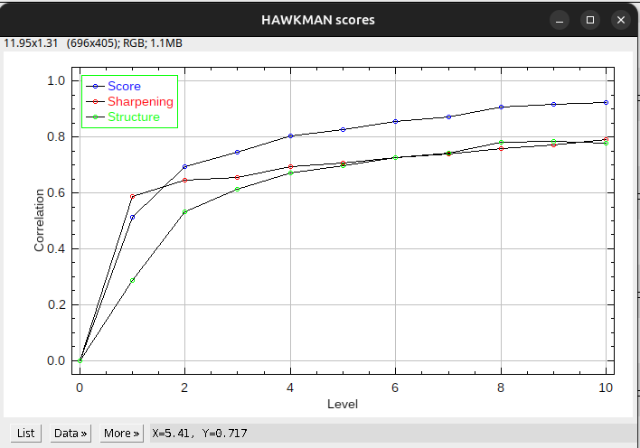

# TERRAPINS - TEsting Resolution, Reliability And Performance IN SMLM

This tool is for assessing 2D SMLM data quality and reliability. SMLM is
particularly prone to artifacts and issues can arise from a number of
different sources which affect the quality of the data. This tool aims
to give a you both a measure of quality but, also how to tune your
experimental setup and highlight the limiting factors of its
performance.

To use this package you will need your raw data, for the HAWK, and your
localisation lists / rendered images for the assessment.

## Data Requirements

- [Drift](#drift) / [Magnification](#magnification)
  - Localisation Workflow - Localisation list
  - Image Workflow - Section split and Half split rendered images
- [Sampling](#sampling)
  - Localisation Workflow - Localisation list
  - Image Workflow - Section split rendered images
- [Blinking](#blinking)
  - Localisation Workflow - Localisation list
  - Image Workflow - Section split and Interleaved split rendered images
- [Bias](#bias)
  - Localisation Workflow - Localisation list and HAWKed Localisation
    list
  - Image Workflow - Standard recon and HAWKed recon
- [Linearity](#linearity)
  - Localisation Workflow - Localisation list and image stack (raw
    frames) for non-linearity and/or true widfield for all other error
    sources
  - Image Workflow - Recon image and image stack (raw frames) for
    non-linearity and/or true widfield for all other error sources

# Processing Flow chart

What do I need to do/steps

## Main types of error tested for

- [Drift](#drift)
- [Sampling](#sampling)
- [Blinking](#blinking)
- [Magnification](#magnification)
- [Bias](#bias)
- [Linearity](#linearity)
- [Limiting Precision](#limiting-precision)

# I want to?

- [Assess my images to help inform my experimental
  setup](#assess-my-images-to-help-inform-my-experimental-setup)
- [Assess my images for a limiting precision
  score](#assess-my-images-for-a-limiting-precision-score)

## Assess my images to help inform my experimental setup

- [I am using localisation
  data](#assess-my-images-to-help-inform-my-experimental-setup-using-localisation-data)
- [I am using
  images](#assess-my-images-to-help-inform-my-experimental-setup-using-image-data)

## Assess my images for a limiting precision score

- [I am using localisation
  data](#assess-my-images-for-a-limiting-precision-score-using-localisation-data)
- [I am using
  images](#assess-my-images-for-a-limiting-precision-score-using-image-data)

## Assess my images to help inform my experimental setup using localisation data

Generate your localisation data using whichever tool you like. Then

open the workflow by selecting the workflow option from the TERRRAPINS
plugin drop down menu.

Select the Localisation Workflow tab

Fill in the instrumentation details and the magnification you would like
your data to be rendered to.

Input the localisation file into the field and select how you would like
to parse it. There is an in built reader for Thunderstorm files
otherwise we can treat it as a csv and you can select appropriate
parsing parameters.

This is enough input to get an idea of how your experiment is setup. If
you have taken a widefield there is no harm in adding it for SQUIRREL
output (also true for the image stack).

With the data input select run and check the logs for what is going on.
When the proces has finished the results viewer should appear

[Refer to the results viewer on how to use the
outputs](#the-results-viewer).

## Assess my images to help inform my experimental setup using image data

Generate your reconstruction(s) using whichever tools you like and load
them into ImageJ. Then

open the workflow by selecting the workflow option from the TERRRAPINS
plugin drop down menu.

Select the Images Workflow tab

Fill in the instrumentation details and the magnification your images
are rendered at.

If you have a true widefield image either fill in its file path or click
use image and select it from the drop down. If you opened the workflow
before you loaded your image click reset images in the bottom left
corner to re-populate the dropdown.

Do the same for the image stack if you have it. N.B if the image stack
is large leave it on disk rather than load it to ImageJ.

Repeat this for the HAWK image and the FRC splits if you have them.

The FRC splits are really important, particularly the drift / section
split, for generating most of the reports. Without them all we can do is
HAWKMAN and SQUIRREL.

If you opened the workflow before you loaded your images click the reset
images button to refresh the dropdown menus. Then select which images
are which from the appropriate menu.

A minimal set of results can be obtained with just a single
reconstruction image derived from the raw data. All other images are
optional but more output will be obtained with the more you supply.

With the data input select run and check the logs for what is going on.
When the proces has finished the results viewer should appear

[Refer to the results viewer on how to use the
outputs](#the-results-viewer).

## Assess my images for a limiting precision score using localisation data

Generate localisation data for the raw image stack using whichever tool
you like. Then run HAWK on the image stack and localise again. HAWK
inputs are required to assess bias and we need to know the bias to
dissambiguate sources of error for other outputs.

Once this is done

open the workflow by selecting the workflow option from the TERRRAPINS
plugin drop down menu.

Select the Localisation Workflow tab

Fill in the instrumentation details and the magnification you would like
your data to be rendered to.

Input the localisation files into the field and select how you would
like to parse it. There is an in built reader for Thunderstorm files
otherwise we can treat it as a csv and you can select appropriate
parsing parameters.

If you have taken a widefield load it into ImageJ, click reset images,
and select it from the drop down menu. Do the same for the raw image
data to. These inputs are for the SQUIRREL analysis and the slightly
different reference images will tell us about about different sources of
error.

With the data input select run and check the logs for what is going on.
When the proces has finished the results viewer should appear

[Refer to the results viewer on how to use the
outputs](#the-results-viewer).

## Assess my images for a limiting precision score using image data

Generate your reconstruction(s) using whichever tools you like and load
them into ImageJ along with the widefield (if you have it) and the raw
data stack. Then

open the workflow by selecting the workflow option from the TERRRAPINS
plugin drop down menu.

Select the Images Workflow tab

Fill in the instrumentation details and the magnification your images
are rendered at.

If you have a true widefield image either fill in its file path or click
use image and select it from the drop down. If you opened the workflow
before you loaded your image click reset images in the bottom left
corner to re-populate the dropdown.

Do the same for the image stack if you have it. N.B if the image stack
is large leave it on disk rather than load it to ImageJ.

Repeat this for the HAWK image and the FRC splits if you have them.

The FRC splits are really important, particularly the drift / section
split, for generating most of the reports. Without them all we can do is
HAWKMAN and SQUIRREL.

If you opened the workflow before you loaded your images click the reset
images button to refresh the dropdown menus. Then select which images
are which from the appropriate menu.

With the data input select run and check the logs for what is going on.
When the proces has finished the results viewer should appear

[Refer to the results viewer on how to use the
outputs](#the-results-viewer).

# The Results Viewer

The results viewer will appear after running the workflow tool but can
also run independently. To load a different dataset just change the data
path field - you can freely type in this box and data will be loaded
automatically if it is valid.

To demonstrate this we will use [Super-resolution fight club
data\[\^1\]](https://www.nature.com/articles/s41592-019-0364-4) \[\^1\]:
Sage, D., Pham, TA., Babcock, H. et al. Super-resolution fight club:
assessment of 2D and 3D single-molecule localization microscopy
software. Nat Methods 16, 387--395 (2019).
https://doi.org/10.1038/s41592-019-0364-4

## Reports

### Drift

This report compares two different FRC curves generated by different
ways to split localisation lists to assess if the sample is drifting.
The main result can be accessed by clicking the "Show Results" checkbox
and looks like this:

This plot shows the two FRC curves. The further apart the two curves are
the more drift is present. The different splits of the data are half (by
number of frames) vs section splitting (drift split). The score is
generated by comparing their resolution (each of which is given in the
text output).

### Blinking

The blinking report again compares two different FRC curves techniques
generated by different splitting techniques, section (aka drift) vs
interleaved (aka zip), and compares their ratio.

The main result can be accessed by clicking the "Show Results" checkbox
and looks like this:

The plot shows both curves and we measure the ratio between them in
resolution at the 0.5 correlation mark.

### Sampling

This report attempts to assess how well sampled your data is. It is
analysing the slope of the FRC curve by comparing the resolution at 2
points. Almost all data is technically undersmapled so the plot shows
your data against simulated calibration curves to indicate how you stand
up against different sampling regimes.

### Magnification

The magnification report attempts to establish if you have oversampled
(mag too high) or undersampled (mag too low) your rendering. If the
magnification is too high you may be intoducing sparcity into your
images that could affect downstream processing. However if the
magnification is too low you could be losing information with analytical
relevance.

The plot, accessed by the "Show Results" checkbox, shows the FRC curve
plotted with where we suggest these tolerances lie.

### Localisation

This gives you the mean precision of the localisations if provided you
provided a localisation table.

### FRC Resolution

The value is taken from the section split method of splitting the data.
The colour however, will reflect if other tests suggest caution in
interpreting this result.

### Bias / HAWKMAN

The bias report attempt to establish where and by how much the fitter
has introduced bias. The main results from this analysis, accessed by
the "Show Results" checkbox, are the combined resolution image and the
score plot.

The image colour codes structures by the level of blur at which bias is
detected.

The score plot shows the level of sharpening and structure between the
images. The sharpening score compares how much the binarised images
agree whilst the structure score compares how well the skeletonised
images agree. The global score combines these two metrics into one value
and when this score approaches 1 there is no bias left and the level
that this it at determines the resolution (level \* super resolution
pixel size).

### Linearity / SQUIRREL

This report attempts to find where error in the reconstruction is not
linear compared to the widefield. It does this by finding optimal
parameters for blurring the reconstruction to match the widefield then
measurring the difference.

The main result from this analysis, accessed by the "Show Results"
checkbox, is the error map.

This is the map of differences. Care must be taken intepretting this and
close attention paid the scale of the differences and not just the
colour of map. It is up to the user what tolerances are significant.

To determine the source of the differences you can compare this map with
the bias report map. Shared areas mean the errors in SQUIRREL are
probably due to bias, with the remaining due to non-linearities.

Intepration is also affected by whether you used a true widefield or
provide an image stack. The image-stack based approach will capture
non-linearities alone whereas with the true widefield we can capture all
other sources of error as well. Using both allows for disambiguation of
error sources.

### Limiting Precision

Limiting precision attempts to estimate the percentage of maximum
possible resolution achieved (calculated from the localisation table -
if provided).

## Results

All the reports come from the output of core tools, the details of which
can be used to probe your data further.

### Recon Results

These results show the image generated, the output from the rendering
process and the localisation table used to generate it. Viewing this
image can be a useful sanity check.

### FRC Results

FRC results will always have two images associated with them from the
different splits of the data. It can be again be useful to view these
images especially for splits like the first half vs second half split;
this can show if there was a temporal compoponent to the parts of the
image localised, which could effect your results.

### HAWKMAN Results

HAWKAN generates a lot of output. This control lets you view the
individual maps generated from the process.

### SQUIRREL Results

SQUIRREL performs a couple of transformations to the data, registration
and scaling, both of which can cause issues if errors occur. It can be
useful to see what inputs exactly were used to generate the map
particulary if you feel the error map is not representative.

# Known issues (`oneclick` branch)

Notes recorded while investigating a one-click path from a raw image stack to a
full assessment (raw stack -> HAWK -> fitter -> `assessment localisation`). They
are on this branch because that work surfaced them, but (2) and (3) are
pre-existing and affect `main` too.

## 1. A fitter with no uncertainty estimate scores an automatic fail

The localisation workflow reads `uncertainty` (or `uncertainty_xy`) out of the
localisation table and uses it for two different things:

- **as the render blur width.** Every localisation is drawn as a patch whose
  sigma *is* its uncertainty - `native/rust/smlm-renderer/src/render_styles/single_point_patch_renderer.rs:74`
  and `integral_renderer.rs:71`.
- **as the mean localisation precision.** `native/rust/smlm-qa/src/tools/renderer.rs:12`
  takes a plain unweighted mean of the column, which feeds the limiting
  precision score at `native/rust/smlm-qa/src/assessment/limiting_resolution.rs:53`
  (`2 * precision / max(bias, frc)`).

A moment-based fitter produces no residual and so no goodness of fit, and
writes the column as a placeholder zero. That gives a mean precision of zero, a
limiting precision score of zero, and an automatic `Fail`. The
"Localisation precision is assumed to be 20nm" fallback in
`limiting_resolution.rs:75` does **not** rescue this: it triggers only on
`None`, and a column of zeros parses as `Some(0.0)`. The reconstruction is
affected independently, since a patch of sigma zero is degenerate.

So the failure is silent and total rather than a missing report line, and it
would be reported as a property of the *data* rather than of the fitter.

**Resolved on the Rust side.** Zero, negative and non-finite uncertainties are now treated as
"no measurement here" rather than as data:

- `native/rust/smlm-locs/src/lib.rs` gains `is_measured_uncertainty` and
  `UncertainLocalisation::has_measured_uncertainty`, so one definition is shared.
- `determine_localisation_precision` returns `Option<f64>`, averaging only the localisations
  that carry a measurement and returning `None` when none do. Placeholder rows no longer drag
  a real mean down either.
- With `None`, the mean precision is simply left unset, so the limiting-resolution assessment
  takes its existing fallback and the report says "Localisation precision is assumed to be
  20nm." The Localisation report item is omitted with a message explaining that the fitter
  reports no uncertainty, rather than scoring zero and failing the data for the fitter's
  limitation. Each report item's error is collected independently, so nothing else is lost.
- Both render styles blur by `patch_utils::blur_sigma_nm`, which substitutes a 20 nm fallback -
  matching what the CSV reader already uses when a file has no uncertainty column at all. This
  matters more than it looks: `blur_2d` with sigma zero evaluates `exp(-d^2/0)/0`, which is
  `0/0` at every pixel, so one placeholder localisation turned the whole reconstruction into
  NaN.

Note the naming trap in this area: a localisation has two quantities that get called sigma, the
fitted peak width (`psf_sigma`) and the uncertainty. Only the uncertainty is used downstream -
it is the render blur width and the precision score. The peak width feeds one optional import
filter (`smlm-locs/src/filters/mod.rs`) and nothing else. The render styles previously read
`let sigma_nm = localisation.uncertainty();`, which is correct but reads like a mistake; it is
now commented.

Still open: producing a real estimate for fitters that have none. Fastfitting now predicts one
from the photon budget (Thompson 2002, calibrated against simulated ground truth), which needs a
camera gain it takes as a new setting. When that gain is absent it writes NaN, which this change
handles as absent.

A second, deeper instance of the same defect - a missing value replaced by a plausible number at
parse time - is covered in issue 2 below. That one was discarding entire files.

## 2. Missing values were replaced by plausible defaults, and import filters then discarded whole files

**EVALUATION AND TESTING OUTSTANDING - parked for the team.** The code change is made and unit
tested, but what it alters is which localisations survive import, so it should be checked against
real files before it is relied on. The suggested checks are at the end of this section.

### What was wrong

A localisation carries two quantities that both get called sigma: the fitted peak width
(`psf_sigma`) and the localisation uncertainty. Only the uncertainty is used downstream - it is
the render blur width and the mean localisation precision. The peak width feeds one thing, the
import filter.

Both were given a default of 20.0 when a file did not carry them
(`smlm-locs/src/constants.rs`), which made "absent" indistinguishable from "measured as 20 nm".
Meanwhile every localisation file is imported through two filters that are on by default
(`smlm-qa/src/settings/localisation_data.rs`):

| filter | default range | applies to |
|---|---|---|
| psf sigma | (20, 2000) exclusive | all localisation files |
| psf sigma | (60, 200) exclusive | HAWK localisation files, set in `assessment/src/main.rs` |

The tighter range on the HAWK path is deliberate and should not be widened without understanding
why it is there: HAWK is prone to picking up fixed pattern noise, which presents as detections at
PSF widths that no real emitter could produce. Filtering to a realistic width range is what keeps
that noise out of the HAWKMAN input. It is a genuine quality cut, not a leftover default - unlike
the (20, 2000) range, whose lower bound the old missing-value default sat exactly on.
| uncertainty | (0, 1000) exclusive | all localisation files |

A default sigma of 20.0 fails `20 < value` exactly. So **a CSV parsed without a sigma column had
every one of its localisations discarded**, silently, with no error - an empty table and an
unexplained empty report. The same held for any fitter writing the conventional placeholder zero
into the uncertainty column: `0 < 0` is false, so **every localisation was discarded**. Both were
confirmed by test before the fix, returning 0 of 2 and 0 of 1 localisations respectively.

Note the second case is not hypothetical for the one-click work: it is exactly what a moment
fitter's output looks like, so this was the first thing that would have broken.

### What changed

- `constants::MISSING` (NaN) replaces `DEFAULT_PSF_SIGMA` and `DEFAULT_UNCERTAINTY`. A quantity
  the file did not carry stays absent instead of becoming a number.
- `is_measured_psf_sigma` joins `is_measured_uncertainty`, with matching
  `has_measured_*` methods on the traits, so there is one definition of "is this real".
- **Filters keep what they cannot judge.** `Bounds::admits` passes a localisation whose value is
  absent, on the grounds that a filter exists to judge a quantity and cannot judge one that is
  not there. A genuine measurement outside the range is still dropped - absence and a bad
  measurement are now different things.
- Parsers treat an empty field as absent rather than failing the line, in both the ThunderSTORM
  and CSV readers. Anything else unparseable is still an error, so a corrupt file is not
  reinterpreted as a file of missing values.
- `LocalisationData::to_localisations` returns an error naming both filters when it would
  otherwise return an empty table, so "everything was filtered out" can never again be silent.

Note `AllocatedLocalisation` derives `PartialEq` and NaN is not equal to itself, so a
localisation with an absent quantity no longer compares equal to a copy of itself. This only
affects tests; nothing in the production path compares localisations. Check the fields, or
`has_measured_*`, rather than the whole struct.

### Still open, deliberately

The filter bounds are **exclusive** (`min < value && value < max`), so a measured value sitting
exactly on a bound is dropped. With absence now handled separately this is only reachable for a
genuine measurement and exact boundary hits are rare in floating point data, so the practical
impact is small - but whether the bounds should be inclusive is a decision about what the filter
is *for*, not a bug fix. It is left as-is and pinned by
`characterisation_measured_value_on_the_filter_boundary_is_dropped`, which should be inverted
rather than deleted if the policy changes.

The (20, 2000) nm general range has not been reviewed. It is very wide, and the fact that the old
missing-value default of 20.0 sat exactly on its lower bound suggests the two numbers were not
chosen together. The (60, 200) nm HAWK range is deliberate - see above.

### Suggested testing

The unit tests cover the decision table - see `psf_sigma_filter_decision_table` and
`uncertainty_filter_decision_table` in `smlm-locs/src/filters/mod.rs`, which are written as
explicit tables of case and expected outcome so the policy can be reviewed by reading them. What
they cannot tell you is whether the policy is right for real data. Worth doing:

1. **Count localisations before and after, on files you know.** Run a dataset that worked before
   this change and confirm the count is unchanged. Any *increase* is localisations that were
   previously being discarded - inspect a few and decide whether they should have been.
2. **A file with no sigma column.** Previously yielded nothing at all. Confirm it now imports,
   renders, and produces a report, and that the report does not claim a 20 nm precision.
3. **A file with a placeholder zero uncertainty**, which is what a moment fitter writes. Confirm
   it imports, renders with the fallback blur width, and that the limiting-precision report says
   the precision was assumed rather than scoring zero.
4. **The HAWK path specifically**, since it carries the tighter (60, 200) nm filter. That filter
   is doing real work - it is what keeps HAWK's fixed pattern noise out of HAWKMAN - so the thing
   to confirm is that it is still removing the noise and not much else. Compare HAWK and raw
   localisation counts for the same dataset and check the discrepancy is of the size you expect
   for your optics; the range assumes a particular PSF, so data at a different wavelength or NA
   may need it adjusted rather than removed.
5. **Deliberately break a file** - a corrupt sigma field, a file of only out-of-range widths -
   and confirm you get the new error naming the filters rather than an empty report.

## 3. ThunderSTORM leaves a results table on screen

**Open, and a UI decision rather than a bug.** A one-click run with ThunderSTORM ends with its
results table window left open. It should not appear at all: the one-click path is meant to look
like one operation, and a table belonging to a component the user did not choose to run is
confusing whether or not it is correct.

It is not one stray call. ThunderSTORM shows the table at three points on the path this drives,
each of them reasonable for its own dialog-driven use:

- `AnalysisPlugIn:304` - `rt.forceShow()` at the end of a run, once fitting completes.
- `AnalysisPlugIn:100` - `IJResultsTable.getResultsTable().show()` on the `showResultsTable`
  command.
- `results/TableHandlerPlugin:43` - `resultsTable.showPreview()` in the `action=reset` branch,
  which the fitter calls before every run to clear the global table.

So `ThunderStormFitter` triggers it twice per localisation - once resetting, once analysing - and
does so twice per one-click run, for the raw stack and the HAWK stream.

Worth deciding before it is fixed:

1. **Where the suppression belongs.** Disposing the window afterwards from `ThunderStormFitter` is
   the smallest change and needs nothing from the vendored code, but it is a flicker rather than
   an absence: the table appears and then vanishes. Suppressing it at the source needs the
   vendored copy to know it is running headlessly, which is a larger and more honest change - and
   the same idea as the fixes the fork already carries.
2. **Whether the user should be able to get it back.** The table is genuinely useful for anyone
   who wants to inspect or filter localisations by hand, so hiding it always may not be right. The
   fitter already writes the same data to a CSV in the working directory, which is the
   reproducible route.
3. **What ImageJ's own results table should do**, since the two are easily confused when both are
   on screen.

Note also that suppressing the window is not merely cosmetic: `ResultsTableWindow` construction is
what the fork's `exitWhenQuitting(false)` mitigation exists for, and not building it at all avoids
that race rather than working around it.

## 4. HAWK stream frames are recomputed on every access

`imagej/.../models/hawk/PStream.java` is a `VirtualStack`: `getProcessor(n)`
regenerates its frame from the raw stack on every call and nothing is cached.
Two consequences:

- with `NegativeValuesPolicy.SEPARATE`, the positive and negative halves of one
  level/offset are two separate slices that each recompute the *same*
  difference, so the arithmetic is done twice.
- each output frame at level `l` reads `2^(l+1)` raw slices. Summed over three
  levels that is ~14 raw slice reads per output position, or ~28 per raw frame
  once the positive/negative duplication is counted.

At the dataset sizes currently expected this is not the limiting factor and is
deliberately left alone. The concern for one-click is the **combination** not
yet measured: the HAWK stream is roughly `2 * n_levels` times the length of the
raw stack, and fitting it means a full pass over all of it. If the raw stack is
itself a disk-backed virtual stack, every one of those recomputed reads goes to
disk, and paging is expected to dominate everything else. A multi-threaded
fitter makes this worse rather than better - `ij.VirtualStack.getProcessor` is
not safe under concurrent access, so the raw stack cannot simply be read from
several threads at once.

Not worth optimising before a working end-to-end version exists, but measure it
early: it determines whether the HAWK stream can stay in memory or has to be
materialised to disk between the HAWK and fitting stages.

## 5. `PStream.getProcessor` indexes transposed, and is only correct on square frames

`imagej/.../models/hawk/PStream.java:186-197`. The accumulation loop indexes
`fp.setf(c, r, ...)` - column as x, row as y, which is correct. The sign
handling loop immediately below indexes `fp.getf(r, c)` and `fp.setf(r, c, ...)`,
with the arguments the other way round.

`FloatProcessor.getf(x, y)` is `pixels[y * width + x]` with no bounds check
(verified against the bytecode of `ij` 1.54k). On a square frame the second loop
therefore visits every pixel exactly once, just in transposed order, and the
result is correct - which is why this has not shown up. On a non-square frame it
does not:

| frame (w x h) | result |
|---|---|
| 8 x 8 | correct |
| 8 x 16 (tall) | 56 pixels never visited, 56 visited twice, 56 negative values survive the positive/negative split |
| 16 x 8 (wide) | `ArrayIndexOutOfBoundsException: Index 128 out of bounds for length 128` |

The tall case is the dangerous one: no exception, and the frames that come out
are wrong in a way that looks plausible. Note also that applying the negative
split twice to the same pixel zeroes it (`max(0, -max(0, -v)) == 0` for `v < 0`),
so the doubly-visited pixels lose data rather than merely being processed twice.

This is a straightforward argument-order slip rather than an origin convention
difference: a bottom-left versus top-left origin would show up as a flip in one
axis (`h - 1 - r`), not as an exchange of the two arguments, and the same method
uses both orders in adjacent loops.

Fix is to swap the arguments in the second loop. Worth a regression test on a
deliberately non-square frame, since no current test would catch it.

# How to get the plugin

Latest ImageJ plugin can be found
[here](https://github.com/Assessing-Quality-SMLM/terrapins/releases/latest)

<!-- # What's the point / Scope? 
A number of techniqeus exist for assessing the quality of data produced in a super resolution experiment however, they all measure something slightly different. Alongside this in order to fully intepret their results sometimes information from other tools are required. This means they should be used together to provide a fuller picture of any issues that may be present in your data. 

Whilst several of these tools exist in isolation, this project aims to provide all the tools in one place, accessible across operating systems and analysis platforms to be integrated into users workflows as they see fit. To this end these tools are accessible as ImageJ plugins, Napari plugins and command line tools as well as being open source for anyone to compile as they see fit (we can also create some C API shared objects / dlls / dylibs for integration into other tools if required). 

# Who's it for?
Anyone doing super-res! However, we are focussing providing easy to use tools for people new to the technique.  -->

# FAQ

## My HAWKMAN is being rejected but it looks fine to me /SRRF didn't throw an error. Is it actually okay?

HAWKMAN failure modes, what to do, but it's probably just bad

## Fixed pattern noise is being picked up as structure (esp SRRF). Is this really a problem? What do I do?

Most common when SRRF is being used in low density situations. Perhaps
try a single or multi emitter fitter.

## My images look fine. Why is the bias report flagging an issue?

The bias report uses the HAWKMAN assessment. This technique can
sometimes go awry, particualry on very sparse data during the
skeletonisation step. You can manually inspect what the tool has done by
heading to the results tab and opening the skeletonisation images and
the scores.

The bias score is determined from global score which weights
contributions from each of the maps. It should be increasing linearly as
the levels increase if the scores do not do this something has gone
wrong.

If, when you look at the skeletonised images, they are not
representative then you can discount this score.

## My FRC scores are not what I expect?

FRC is based on a Fourier transform; consequently there are 2 main
sources of errors, missalignment when cropping a ROI or if your data is
highly structured, particularly over long ranges, e.g. a structural
motif is repeated across the image.

In the case of cropping an image take your time and be accurate, FRC can
produce unexpected results with single pixel missalignments. Also be
sure to crop all the data you are using; widefields, image stacks,
recons and recon localisation lists etc.

Different analysis packages can also produce different alignments so if
using the image workflow that images are rendered with the same
technique from the same package.

In the case of highly structured data artefacts can be introduced into
the spectrum which can be hard accomodate. If you are only interested in
a particular part of the image try cropping it out and running the
assessment on that.

Also make sure you have [handled your fiducial markers
appropriately](#have-i-excluded-fiducial-markers)

## Is My Data Suitable for Assessment?

This can depend on the exact research question below are some general
steps you can take before interpretting the assessment output.

### Is there any data?

Open your images up and look at the histogram. Is what you expect?

### Has my pre-processing been applied correctly?

#### Have I drift corrected effectively?

The drift report can help with this. Some datasets respond better than
others to different drift correction techniques as well as their
settings. If one technique / settings are not improving the drift report
try something else.

#### Did my fitter do something sensible?

What does the localisation table look like? Localisations should be
realistic; psf sigmas should be neither too high nor too low, likewise
uncertainty - internally we filter these properties which can remove
lots of data if it was not great to begin with. N.B processing can
effect these properties as well, for example HAWK processing whilst
helping to remove bias will decrese precision.

#### Do I need to merge localisations?

If your reconstructed image shows lots of clustering it may be that
localisations need to be merged, or merged more aggressively.

#### Have I excluded fiducial markers?

Fiducial markers can introduce several issues when retained in the
assessment images. For example, in FRC based measures they will be in
both sets of images regardless of splitting technique masquerading as
structure. Equally in the bias test they will distort the adaptive
threshold that gets applied to the images.

We would advise you keep them in for performing drift correction and
they can be left in for localising / fitting. However, you will need to
either crop out a part of the image without these or mask them out
before the assessment. We would reccomend croping them out if possible
as masking can introduce other sources of artefact.

<!-- SQUIRREL widefield needs them to be blocked out - common mask. with common mask in widefield will introduce a sharp edge which wont be in super-res with effects of background dominating in this region -->
<!-- # Usage

## ImageJ

### I have Localisation Data

### I have Image Data

## I want to use an Individual Tool

## Napari
Watch this space

## CLI

# It doesn't work / I Have a Problem 
This is actively support so please raise an issue. 

# I Want to Build My Own Binaries
 -->

#test text to generate build
